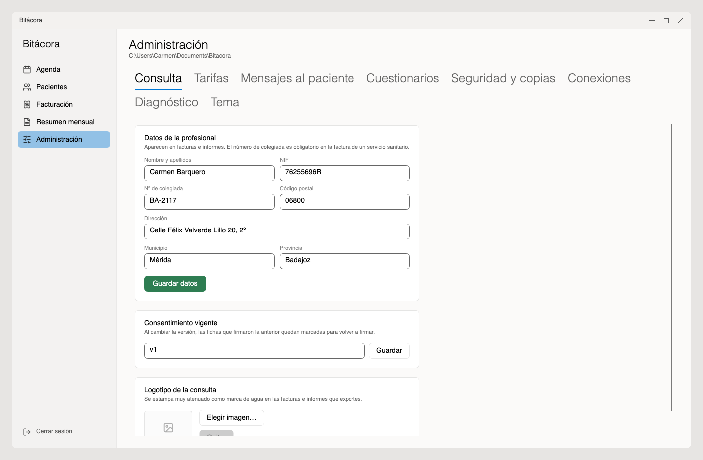
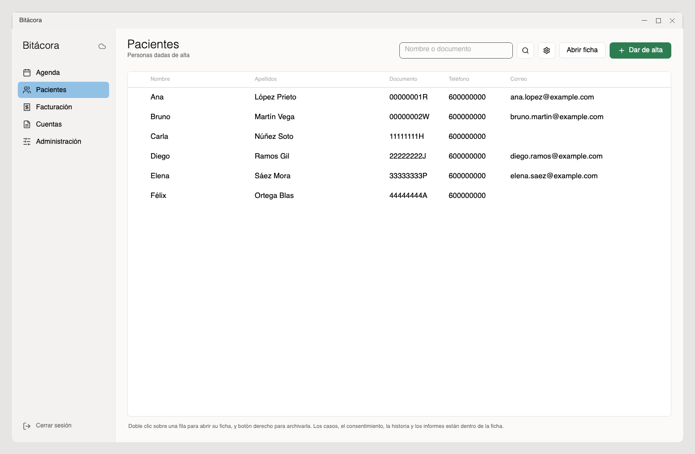
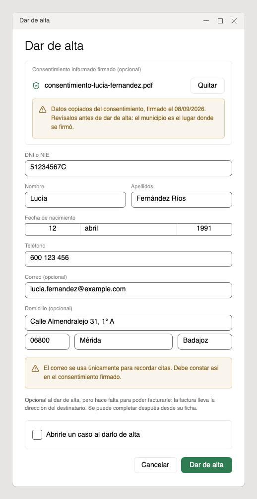
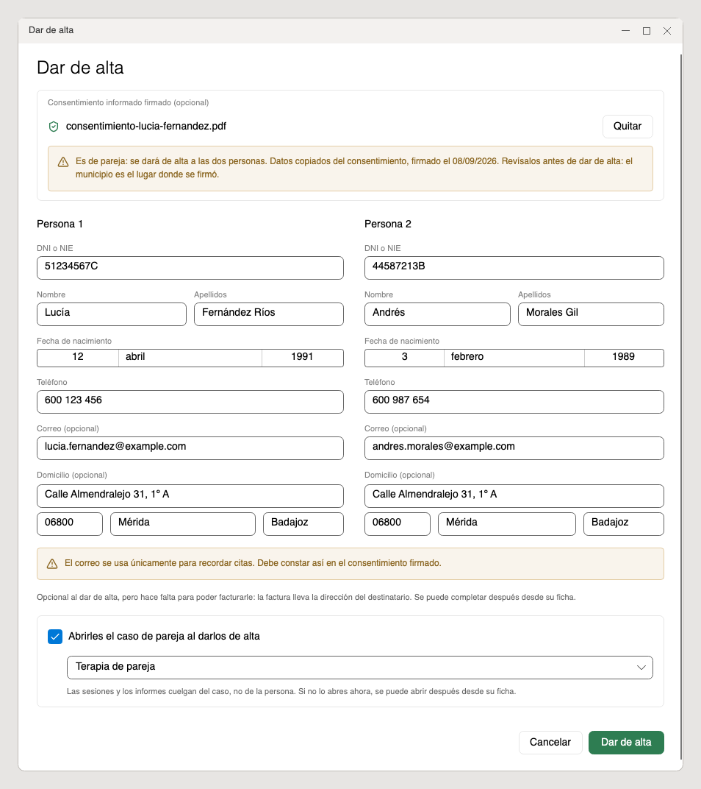
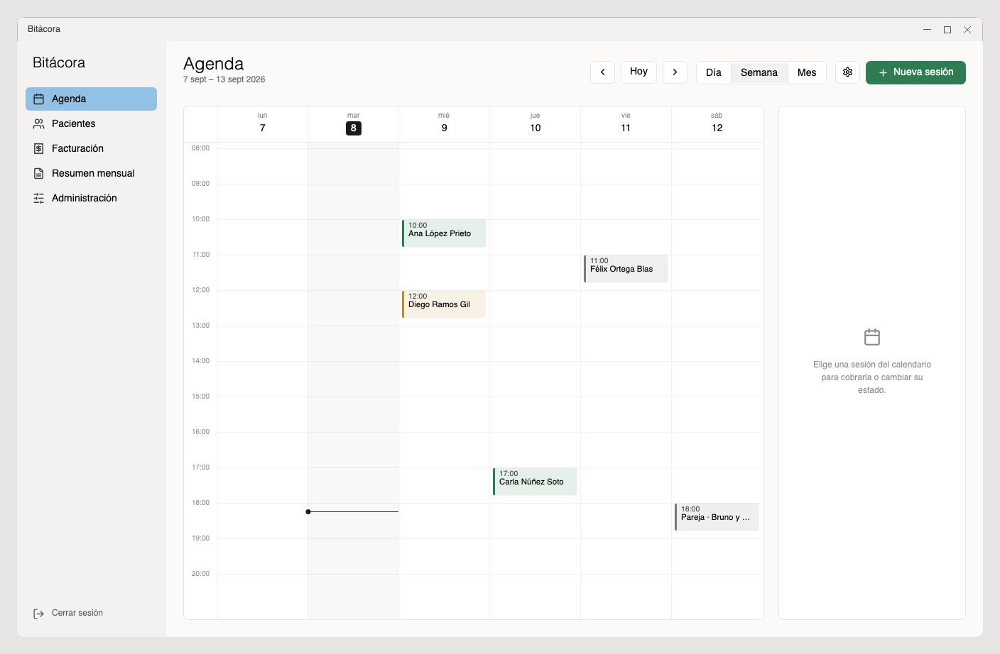
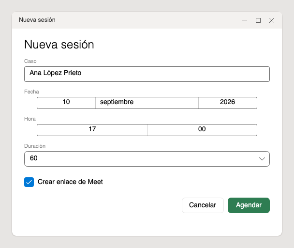
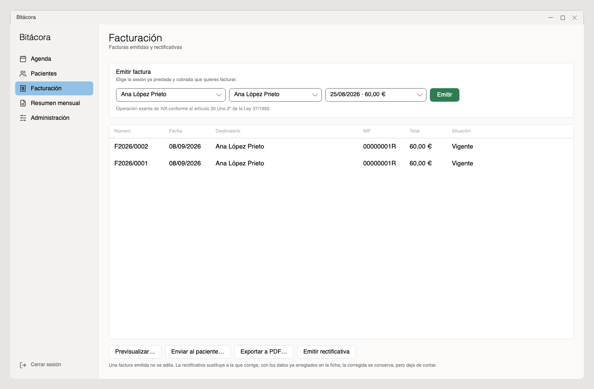
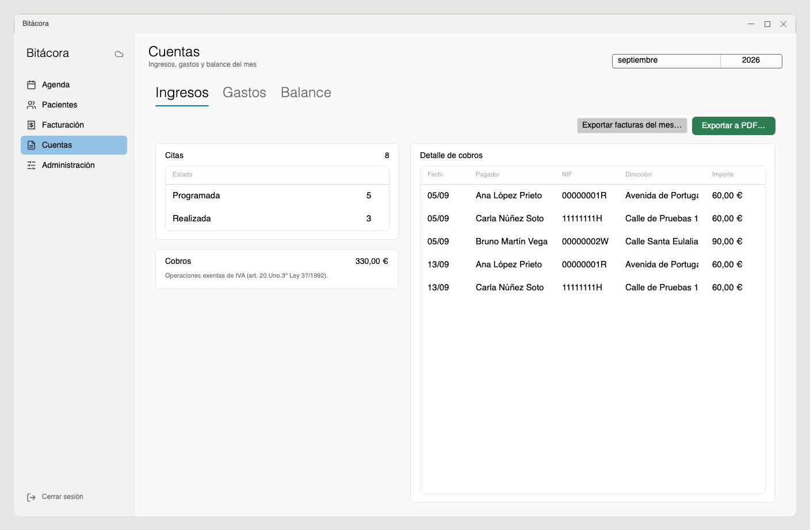

# Bitácora · guía de uso

Para Carmen. Va en el orden en que se hacen las cosas: primero saber qué es,
luego instalar, luego dejar la consulta configurada, y después el día a día.

**No hace falta leerla entera.** Las secciones 2, 3 y 4 son de una sola vez. De
la 5 a la 10 está lo que se usa todos los días, y es lo que conviene tener a
mano. La 11, **Avanzado**, es lo que se hace una vez o el día que pasa algo:
está al final porque no estorba, no porque sea menos importante.

---

## 1. Qué es Bitácora

Un programa de escritorio para llevar una consulta de psicología entera: **a
quién atiendes, cuándo, si te ha pagado y qué has escrito de cada sesión.**

Se instala en el ordenador y **los datos se quedan ahí, cifrados**. No hay
servidor, no hay cuenta de empresa y nadie más los puede leer. Lo único que sale
fuera son las copias de seguridad —que salen ya cifradas— y lo que tú decidas
mandar: un correo de cita, una factura.

### Lo que hace, en cinco líneas

| Sección | Para qué |
|---|---|
| **Agenda** | El calendario de sesiones. Se agenda, se avisa al paciente, se cobra y se cancela desde aquí. |
| **Pacientes** | Las fichas: datos, consentimiento firmado, casos abiertos, historia clínica, informes, tests. |
| **Facturación** | Una factura por sesión, exenta de IVA, con su numeración correlativa. |
| **Cuentas** | Lo cobrado, lo gastado y el balance, mes a mes. Lo que pide la gestoría. |
| **Administración** | Los ajustes: tus datos, tus tarifas, la seguridad, la conexión con Google. |

### La ventana

Una barra a la izquierda con esas cinco secciones, y a la derecha lo que hayas
elegido. En esa barra hay además tres cosas:

- Arriba, junto a «Bitácora», un **icono de nube** que dice cómo está la
  conexión con Google. Explicado en [Google a fondo](#112-google-a-fondo).
- Abajo, **Actualizar y reiniciar**, que solo aparece cuando hay una versión
  nueva.
- Abajo del todo, **Cerrar sesión**, que devuelve a la pantalla de la
  contraseña sin cerrar el programa. Es lo que se pulsa al levantarse de la
  mesa: deja la sesión abierta pero los datos cerrados.

### Lo que no hace

No diagnostica, no interpreta y no decide nada por ti. Cuenta puntuaciones de
test y clasifica por tramos, pero la lectura clínica es tuya. Y no manda nada al
paciente sin que lo hayas visto antes, con una sola excepción: el recordatorio
automático de cita, que se configura una vez y va solo.

---

## 2. Instalar

Funciona en **Windows**, **Mac** y **Linux**, y es la misma aplicación en los
tres: las pantallas, los datos y todo lo que cuenta este manual son idénticos.
Lo único que cambia es cómo se instala y el aviso que cada sistema da la primera
vez.

Ese aviso sale porque el programa todavía no lleva firma de empresa. **En
ninguno de los tres es un aviso de virus.** Ve a lo tuyo y sáltate el resto.

### En Windows

1. Descargar el instalador, que siempre apunta a la última versión:
   <https://github.com/CastilloStudio/bitacora-descargas/releases/latest/download/Bitacora-win-Setup.exe>
2. Ejecutarlo. Sale una ventanita de progreso y, al terminar, la aplicación se
   abre sola.

**Windows dirá que no reconoce el programa**: una pantalla azul, «Windows
protegió tu PC». Pulsar **Más información** → **Ejecutar de todas formas**.

Los datos van a `Documentos\Bitacora`. Si Documentos estuviera sincronizado con
OneDrive, van a una carpeta local del equipo, para no corromper la base.

### En Mac

Hace falta un Mac con **Apple Silicon** (M1 o posterior). Los Mac con procesador
Intel no pueden con esta versión.

1. Descargar el instalador:
   <https://github.com/CastilloStudio/bitacora-descargas/releases/latest/download/Bitacora-osx-Setup.pkg>
2. Abrirlo y seguir los pasos. Bitácora queda en **Aplicaciones**.

**La primera vez, el Mac no la dejará abrir con doble clic.** Dirá que no se
puede comprobar quién la hizo. Solo esa primera vez:

1. Abrir **Aplicaciones** en el Finder.
2. **Control + clic** sobre Bitácora (o clic con el botón derecho) → **Abrir**.
3. Sale el mismo aviso, pero ahora con un botón **Abrir**. Pulsarlo.

A partir de ahí se abre con doble clic como cualquier otra, y no vuelve a
preguntar —tampoco cuando se actualice sola—.

Los datos van a `Documentos/Bitacora`. Si tuvieras Escritorio y Documentos
sincronizados con iCloud, van a una carpeta local del equipo.

### En Linux

1. Descargar el archivo:
   <https://github.com/CastilloStudio/bitacora-descargas/releases/latest/download/Bitacora-linux-x86_64.AppImage>
2. Darle permiso de ejecución: clic derecho → **Propiedades** → **Permisos** →
   permitir ejecutar como programa. En terminal,
   `chmod +x Bitacora-linux-x86_64.AppImage`.
3. Abrirlo con doble clic. No instala nada: el AppImage *es* la aplicación.

Linux no da ningún aviso de procedencia. Los datos van a una carpeta
**Bitacora** dentro de tu carpeta personal.

### Lo que vale para los tres

**No pregunta dónde guardar los datos**: eso ya está decidido. La ruta exacta se
ve luego en **Administración**, debajo del título, y conviene saberla para las
[copias en USB](#10-copias-de-seguridad).

**Se actualiza sola.** Cada vez que se abre comprueba si hay versión nueva;
cuando la hay, aparece **Actualizar y reiniciar** al pie de la barra izquierda.
Al volver a entrar, una ventana cuenta lo que ha cambiado. Se cierra al pulsar
**Aceptar**, no antes: da tiempo a leerla. Sale una sola vez por versión.

> Si algún enlace no funcionara, abrir
> <https://github.com/CastilloStudio/bitacora-descargas/releases> y descargar el
> archivo de tu sistema de la versión de arriba. En esa lista hay más archivos
> (`.nupkg`, `.json`…); no hacen falta.

---

## 3. Crear la consulta

Solo la primera vez. Al abrirla sale **«Vamos a preparar la consulta»**.

1. Elegir un **nombre de usuario** y una **contraseña** de al menos doce
   caracteres.
2. Repetirla y pulsar **Crear la consulta**.
3. Sale una última pantalla, **«Conectar con Google»**. Se puede hacer ahora o
   pulsar **Ahora no** y dejarlo para después. En los dos casos se entra a
   continuación en **Administración**.

**Sobre la contraseña, que esto importa de verdad.** Todo va cifrado con ella:
la base de datos y también las copias de seguridad. No se guarda en ninguna
parte, ni siquiera cifrada, así que **nadie puede recuperarla**: ni yo, ni
Google, ni reinstalando. Si se pierde la contraseña y no hay clave de
recuperación, los datos no se abren nunca más.

La clave de recuperación se genera en el paso siguiente y es el único seguro que
existe contra eso.

> Si ya hubiera una consulta en otro ordenador, en esta misma pantalla están
> **Buscar en Drive…**, **Desde una carpeta…** y **Desde un archivo…**.
> Explicados en [Recuperar el acceso y los datos](#118-recuperar-el-acceso-y-los-datos).

---

## 4. Dejar la consulta lista

Al entrar se aterriza en **Administración**, repartida en pestañas: *Consulta*,
*Tarifas*, *Mensajes al paciente*, *Cuestionarios*, *Seguridad y copias*,
*Conexiones*, *Diagnóstico* y *Tema*.

**Para empezar a trabajar solo hacen falta cuatro cosas**, y son las que vienen
abajo. El resto viene ya puesto de fábrica o solo hace falta el día que lo
necesites, y está en [Avanzado](#11-avanzado).

### 4.1 Los datos de la consulta

Pestaña **Consulta**. Tres cosas:

- **Datos de la profesional**: nombre y apellidos, NIF, número de colegiada,
  dirección. Salen en las facturas y en los informes. **El número de colegiada
  es obligatorio** en la factura de un servicio sanitario. Pulsar **Guardar
  datos**.
- **Consentimiento vigente**: una etiqueta con la versión del documento que se
  está haciendo firmar (por ejemplo `2026-01`). No es el documento: solo sirve
  para saber quién firmó qué. Al cambiar la versión, las fichas que habían
  firmado la anterior **quedan marcadas**, y al abrirlas sale un aviso de que
  hay que volver a firmar.
- **Logotipo de la consulta**: se estampa como marca de agua muy atenuada en
  facturas, informes y expedientes. Opcional, y se quita con **Quitar**.

### 4.2 Tarifas y plazos

Pestaña **Tarifas**. Se guarda todo junto con **Guardar tarifas**.

- **Tipos de terapia**: lo que ofrece la consulta. Vienen dos puestas,
  **Terapia individual** y **Terapia de pareja**. Con **Añadir** se crean más:
  nombre (por ejemplo «Individual online»), precio, y marcar **De pareja** si
  necesita dos personas. El precio de cada terapia es el que se aplica a las
  sesiones de los casos abiertos con ella.
- **Enlace del consentimiento**: debajo de cada terapia, la dirección de la
  página donde se rellena su consentimiento —cada terapia tiene la suya, porque
  el documento anuncia su precio y sus condiciones—. **Copiar** lo deja en el
  portapapeles para mandárselo por WhatsApp o por correo; **Abrir** lo abre en
  el navegador. Es lo que se manda *antes* de dar de alta a alguien: cuando
  llegue el PDF firmado, se adjunta en el alta y la ficha se rellena sola.
- **Retirar una terapia**: el interruptor de su línea. Deja de ofrecerse al
  abrir casos nuevos, pero **no se borra nada**: los casos que ya la usaban
  siguen igual y su historial de precios se conserva.

Y cuatro plazos:

| Ajuste | Qué hace | De fábrica |
|---|---|---|
| **Aviso para cancelar** | Por debajo de ese margen, la sesión cancelada se cobra entera | 24 h |
| **Recordar al paciente** | Horas antes de la sesión para enviarle el recordatorio. 0 = no enviar | — |
| **Aviso de Google Calendar** | Minutos antes para que el calendario te avise a ti, en el móvil o en el ordenador. 0 = sin aviso | 15 min |
| **Plazo para recuperar una sesión** | Días de crédito cuando se cancela una sesión ya pagada | 30 |

Cambiar una tarifa **solo afecta a lo que se agende a partir de ese momento**.
Las sesiones ya agendadas conservan el importe que tenían.

### 4.3 La clave de recuperación

**Esto es lo más importante de toda la guía.** Es lo único que permite entrar si
se olvida la contraseña.

1. **Administración › Seguridad y copias**, bajar hasta **Clave de
   recuperación**.
2. Escribir la contraseña en **Confirma tu contraseña**.
3. Pulsar el botón de generar.
4. Sale un código de ocho grupos, tipo `4KWQ-9M2T-…`. Pulsar **Guardar en un
   archivo…**, imprimirlo, y **guardar el papel fuera del ordenador**: una
   carpeta física, una caja fuerte, en casa.
5. Pulsar **Ya la he guardado** para que desaparezca de pantalla.

No sirve de nada guardarlo en el mismo ordenador, ni en el correo. Generar una
clave nueva invalida el papel anterior.

### 4.4 Conectar Google

Opcional, pero sin ello no funcionan cuatro cosas: **las sesiones no aparecen en
el calendario**, no se pueden crear **enlaces de Meet**, no salen los **correos**
al paciente y las **copias no suben a Drive**.

Se conecta en **Administración › Conexiones**, cargando el archivo de
credenciales `client_secret.json` y aceptando en el navegador con la cuenta de
la consulta. De dónde sale ese archivo, cómo se desconecta y qué ve Google
exactamente está en [Google a fondo](#112-google-a-fondo).

**Lo que hay que saber hoy**: al calendario solo va una etiqueta del tipo
`Sesión · AR-3f9c1b`. Nunca el nombre del paciente ni el motivo de consulta, y
el paciente no se añade como invitado.

---

## 5. Pacientes

El listado de la gente que pasa por la consulta. **Abrir ficha** —o doble clic
sobre la fila— entra en la suya.

La lupa busca por **nombre o por documento**, así que vale el DNI si no recuerdas
cómo se escribía el apellido. Y en la primera columna aparece una **tarta** junto
a quien cumple años ese día, para poder felicitarle al entrar por la puerta.
Sale solo ese día y no hace nada más. A quien nació un 29 de febrero se le marca
el 28 los años que no son bisiestos.

### Qué se enseña en el listado

De entrada solo **quien tiene un caso abierto**: lo normal es buscar a alguien
que está en terapia, no repasar a todos los que han pasado por la consulta. El
botón de la **rueda dentada**, junto a la lupa, añade dos casillas:

- **Pacientes sin caso abierto**: dados de alta pero sin terapia en curso.
- **Pacientes archivados**: las fichas archivadas, con una **caja** en la
  primera columna para distinguirlas.

A diferencia de las de la agenda, estas dos no se recuerdan: cada vez que se
abre la aplicación el listado vuelve a empezar por la gente en terapia.

### Ordenar el listado

El nombre y los apellidos van en **dos columnas**, y el listado sale ordenado por
**nombre** —y a igualdad de nombre, por apellidos—, que es como se lee la tabla de
izquierda a derecha. En la misma **rueda dentada**, debajo de las dos casillas, se
puede cambiar a **apellidos y nombre**, que es el orden de listín de toda la vida.

Las tildes y la eñe van donde deben: Ángela entre Alba y Beatriz, y Ñuño entre
Nadal y Ortiz.

**El orden sí se recuerda**, al revés que las dos casillas de encima. La diferencia
tiene su motivo: aquéllas esconden fichas, y cada día conviene empezar viendo a
quien está en terapia; un orden no esconde a nadie, así que dejarlo puesto no puede
hacerte creer que a alguien no le diste de alta.

Las cabeceras de la tabla no ordenan al pulsarlas. El orden se elige en la rueda y
solo ahí, para que no haya dos mandos diciendo cosas distintas.

### Dar de alta a un paciente

**Pacientes** → **Dar de alta**. La ventana pide, de arriba abajo:

1. **El consentimiento firmado**, si ya lo trae. Se adjunta con **Adjuntar PDF
   firmado…** o arrastrándolo sobre el recuadro.
2. **DNI o NIE, nombre, apellidos, fecha de nacimiento, teléfono y correo.** El
   correo es opcional, pero sin él no se le pueden enviar avisos de cita.
3. **El domicilio**, también opcional —pero **hace falta para facturarle**, que
   la factura lleva la dirección del destinatario—. Va todo junto: calle, código
   postal, municipio y provincia. Media dirección no vale, y la ventana avisa.

**Si el consentimiento se firmó en la web de la consulta, los datos se copian
solos** al formulario: nombre, apellidos, DNI, fecha de nacimiento, teléfono,
correo y domicilio. La provincia sale del código postal y el municipio del lugar
de la firma, que conviene revisar. Todo queda a la vista para corregirlo antes de
pulsar **Dar de alta**. Un consentimiento escaneado en papel se adjunta igual,
pero sin copiar nada: los datos se teclean.

No se guarda nada hasta pulsar **Dar de alta**; si el alta no sale —un DNI
repetido, por ejemplo— el PDF tampoco se queda guardado. Si se adjunta el que no
era, **Quitar**.

**Si esa persona ya tuvo ficha**, el alta no la puede crear otra vez: avisa de
que ese DNI ya existe y ofrece **Abrir su ficha**, que lleva directamente allí
para registrarle el consentimiento nuevo.

### Abrir un caso

Una persona dada de alta todavía no tiene terapia: **las sesiones y los informes
cuelgan del caso, no de la persona.** Una misma persona puede tener a la vez un
caso individual y uno de pareja, cada uno con su historia y su facturación.

Desde la ficha, arriba a la derecha, **+ Abrir caso**. Se elige el **tipo de
terapia**; si es de pareja, pide además a la otra persona con **Elegir…**, y esa
persona tiene que estar dada de alta antes.

> El botón está fuera de la ficha, junto al nombre, y no dentro: ahí abajo hay
> ya un desplegable de **Caso** que sirve para *cambiar de caso en curso*, y los
> dos juntos se confundían.

También se puede abrir en el mismo momento del alta, marcando **Abrirle un caso
al darlo de alta**. Ahí, si la terapia es de pareja, la otra persona no hace
falta que exista antes: **Darla de alta a la vez** la crea en la misma ventana.

### Cuando son dos: el consentimiento de pareja

Si el PDF que se adjunta es un **consentimiento de pareja**, el diálogo se
ensancha y pone a las dos personas una al lado de la otra, cada una con sus
datos, y el caso que ofrece abrir es el de pareja. Si una de las dos ya tenía
ficha (mismo DNI), lo dice al adjuntar y se usa la suya, sin cambiar sus datos:
solo se le registra el consentimiento nuevo.

Lo mismo se puede hacer **a mano**, sin consentimiento: al marcar **Abrirle un
caso** con una terapia de pareja, la otra persona se **Elige…** entre las fichas
o se **Da de alta a la vez**. **Quitar**, en su cabecera, vuelve al alta de una
sola persona.

Un consentimiento escaneado adjuntado así se registra a las dos. Uno individual
de la web no, porque lo firmó una sola persona: para la pareja hace falta el de
pareja.

### Registrar el consentimiento después

Si no se adjuntó en el alta: ficha → pestaña **Resumen** → tarjeta
**Consentimiento informado** → **Registrar consentimiento firmado…**. También
vale **arrastrar el PDF** sobre el recuadro de puntos: se enciende cuando lo que
llevas encima vale y se pone rojo cuando no (un Word en vez de un PDF, o varios
archivos a la vez).

Queda guardado cifrado dentro de la ficha. Al lado, un icono y una línea dicen
si está firmado y con qué versión. **Ver consentimiento firmado…** lo abre en
una ventana aparte, descifrándolo en memoria: para mirarlo no hace falta dejar
una copia suelta en el disco.

**Los consentimientos no se pisan.** Al registrar uno nuevo, el anterior pasa a
**Anteriores**, debajo, con su fecha y su versión, y se abre igual con **Ver…**.
El de arriba es el que vale hoy; los de abajo son la prueba de a qué consintió
mientras estuvieron vigentes, que es lo que hay que poder enseñar si alguna vez
se discute una sesión de entonces.

### Cerrar un caso

Cuando la terapia termina: en la tarjeta del caso, **Cerrar caso**, y se indica
la fecha. Un caso cerrado no admite citas nuevas, pero su historia, sus informes
y sus facturas se conservan. **Reabrir** lo vuelve a activar.

Cerrar los casos hace falta, además, para poder suprimir la ficha más adelante:
una ficha con casos abiertos no se puede suprimir (ver [Derechos del
paciente](#115-derechos-del-paciente)).

### Archivar una ficha

Con los años se acumulan fichas de gente que ya no viene y que estorba al buscar.
**Botón derecho** sobre su fila → **Archivar**, y deja de salir en el listado.

Archivar es **solo una manera de ordenar la lista**. No cierra sus casos, no
borra nada, no le quita el correo y no tiene nada que ver con *suprimir*, que es
el derecho del RGPD y va por otro sitio. Por eso no pide confirmación: se deshace
igual de rápido, con **Desarchivar** en el mismo botón derecho.

Si alguien archivado vuelve a terapia, basta con abrirle un caso: sale solo del
archivo, para que no quede escondido justo cuando más se le busca.

---

## 6. Agenda

El calendario de sesiones, y el sitio donde se cobra.

### Los tres modos

Se eligen en la cabecera. Las flechas **‹** y **›** mueven un día, una semana o
un mes según el modo; **Hoy** vuelve al presente.

- **Día**: la jornada hora a hora. La columna es ancha, así que cada sesión se
  lee sin abrirla: hora de inicio y fin, duración, paciente, importe y cobro.
  Arriba, cuántas sesiones hay, lo que suman y lo que queda por cobrar.
- **Semana**: una columna por día. Es el modo de trabajo y con el que se entra.
- **Mes**: para encuadrar el mes, no para cobrar. No hay panel de la derecha;
  hay un pie con las sesiones del mes, lo previsto, lo cobrado y lo pendiente,
  con la leyenda de colores. En cada casilla caben cuatro sesiones: si hay más,
  pone «+2 más».

En Día y Semana, una línea fina cruza la jornada de hoy por la hora que es. La
franja va de las 8 a las 20 salvo que haya sesiones fuera de ella: entonces se
estira, porque una rejilla más alta se baja con la barra y una sesión escondida
no se ve nunca.

**Del mes al día.** En **Mes**, la franja estrecha con el número de semana abre
esa semana; una casilla abre ese día; y pulsar **una sesión** baja a su día y la
deja elegida en el panel. En el mes no se cobra, así que el clic lleva al único
sitio donde sí se puede.

### Qué se enseña

La **rueda dentada**, junto a los tres modos, despliega dos casillas. Las dos se
quedan como se dejen, también al reabrir la aplicación.

- **Fin de semana** añade sábado y domingo. Viene apagado porque sin esas dos
  columnas las cinco de diario son bastante más anchas. Si hay una sesión en
  sábado o domingo, **su columna sale igual**: una preferencia de ancho no puede
  esconder una cita.
- **Sesiones canceladas** viene puesto. Al quitarlo dejan de dibujarse y su hora
  vuelve a ofrecerse como rato libre. Las ausencias («no asistió») **no** se
  esconden: esas se cobran íntegras y tienen que verse.

Esconderlas es una manera de mirar, no de contar: los pies del día y del mes
siguen incluyendo todo lo que hay, esté a la vista o no.

### Agendar una sesión

**+ Nueva sesión**. Se elige el caso, la fecha, la hora y la duración (30, 45,
50, 60, 75 o 90 minutos). **El importe no se pide**: sale de la tarifa del tipo
de terapia del caso.

- **El caso** se busca escribiendo el nombre del paciente. Entrando en el campo
  sin escribir nada se despliega la lista entera, para cuando no recuerdas el
  nombre exacto.
- **Para online**, dejar marcado **Crear enlace de Meet**. Si prefieres otro
  (Zoom, el que sea), se desmarca y se pega el enlace en el campo de abajo.
- **Atajo**: en **Día** y en **Semana**, al pasar el ratón por un rato libre
  aparece **+ Agendar a las …**, que abre la misma ventana con ese día y esa
  hora puestos. Los ratos libres se ofrecen de media en media hora y solo de hoy
  en adelante.

Pulsar **Agendar**.

**Dos sesiones no se pueden pisar.** Si en ese hueco ya hay otra, lo dice y no
agenda —y lo mismo al reprogramar—. Las canceladas no cuentan: su hora queda
libre. Las de «no asistió» sí, que esas ocuparon la hora.

Tampoco se puede agendar **hacia atrás**, ni en un **caso cerrado**.

### Avisar al paciente

Justo después de agendar sale **Enviar la cita**, con el correo ya redactado:
destinatario, asunto y mensaje, todo modificable. **Enviar al paciente** lo
manda; **Ahora no** lo deja sin enviar. **La sesión queda agendada en los dos
casos**: esa ventana solo decide si se avisa.

La misma ventana sale al **reprogramar**, con los datos de la cita nueva y el
texto adaptado para que se entienda que es un cambio de hora.

> Si el paciente no tiene correo en la ficha se puede escribir ahí mismo, pero
> **ese correo no se guarda**: vale para ese envío y nada más. Si va a seguir
> viniendo, conviene ponérselo en la ficha —si no, tampoco le llegarán los
> recordatorios automáticos—.

**Por WhatsApp**: clic derecho sobre la sesión → **Abrir en WhatsApp**. Se abre
la conversación con el paciente (el teléfono de su ficha) y con el mismo texto ya
escrito. **No se envía solo**: se revisa y se pulsa Intro. No hace falta tenerlo
guardado en los contactos.

Si el ordenador no tiene WhatsApp instalado se abre WhatsApp Web, y el texto
queda copiado de todas formas. Si el teléfono de la ficha no se entiende —lleva
letras, o son dos números—, Bitácora no abre nada y pide corregirlo: es
preferible a escribir a quien no es. Un número de fuera de España se escribe con
su prefijo, `+44 7700 900123`.

**Copiar invitación**, en el mismo menú, solo copia el texto.

> WhatsApp no deja que un programa envíe mensajes por su cuenta desde un número
> normal, y es mejor así: saltárselo incumple sus condiciones y puede acabar con
> el número bloqueado. Por eso los recordatorios automáticos van por correo.

**El recordatorio automático** —el de [Tarifas](#42-tarifas-y-plazos)— se manda
al abrir Bitácora, no por su cuenta con el ordenador apagado: si un día no se
abre el programa, ese día no se avisa a nadie. Es a propósito, porque un envío
que falla sin que nadie lo vea es peor que no enviarlo. Cada sesión se recuerda
**una sola vez**, así que abrir y cerrar el programa varias veces no repite el
correo.

El texto de los cuatro correos que escribe Bitácora se cambia de una vez para
siempre en [Mensajes al paciente](#113-mensajes-al-paciente).

### Los colores del cobro

Cada sesión lleva su color en el filete de la izquierda, y el texto que dice lo
mismo sale en el panel de la derecha al elegirla (en **Mes**, en la leyenda del
pie). **El color va siempre acompañado de su texto**: impreso en blanco y negro,
o visto con daltonismo, no distingue una sesión impagada de una que se abona por
haberse cancelado tarde.

| Color | Dice | Qué es |
|---|---|---|
| **Verde** | Pagada | Cobrada. Ya se puede facturar |
| **Neutro** | Pendiente | Sin pagar, con margen todavía |
| **Ámbar** | Sin pagar · menos de 24 h | Sin pagar y ya dentro del plazo de aviso. Es la que hay que mirar |
| **Rojo** | Impagada | La sesión ya empezó y sigue sin cobrarse |
| **Rojo** | Se abona íntegra | Cancelada fuera de plazo, o ausencia sin avisar |
| **Azul** | Sin cargo · crédito | Cancelada sin cargo, pero estaba pagada: queda crédito |
| **Gris** | Sin cargo | Cancelada en plazo. No hay nada que cobrar |

Las sesiones que no llegaron a darse salen además **tachadas**: el color dice
cuánto se cobra y el tachado dice si ocurrió, que son dos preguntas distintas.

De una sesión cobrada **sin forma de pago** —las de antes de que se guardara, o
una cubierta con un crédito viejo— el panel avisa de que no consta cómo entró el
dinero. Se arregla con **Corregir la forma de pago**, y hace falta: la factura la
lleva impresa. Se dice aquí, que es donde se arregla, y no al intentar facturar.

### Cobrar y cerrar una sesión

Al pulsar una sesión se llena el panel de la derecha:

- **Pagada** cobra por Bizum sin preguntar, que es como entra casi todo. La
  flechita del botón abre **Pagada por Bizum** y **Pagada por transferencia**.
  La forma de pago queda guardada y es la que sale impresa en la factura.
  (**Anular el pago** si se marcó por error.)
- **Corregir la forma de pago**, en una sesión ya cobrada: **Se cobró por
  Bizum** / **Se cobró por transferencia**. Cambia solo la forma; **la fecha del
  cobro no se mueve**, que es lo que pasaría anulando y volviendo a marcar. Si
  esa sesión ya estaba facturada, la factura no cambia: hay que
  [rectificarla](#119-rectificar-una-factura).
- **Realizada**: la sesión se dio.
- **No asistió**: no vino y no avisó. Se cobra.
- **Reprogramar**: la mueve conservando el importe y el pago. Es lo que se usa
  cuando el paciente no puede venir pero se le va a dar la sesión igualmente.

Si al dar una sesión por **realizada** ya estaba pagada, sale **Emitir factura**,
que ofrece facturarla ahí mismo sin pasar por Facturación. Si el caso es de
pareja se elige a quién se le factura. **Ahora no** la deja sin facturar.

### Cancelar

- **Cancelar sesión** es la cancelación normal. No hay que echar cuentas: el
  programa mira la hora y decide. Con el margen pactado por delante queda sin
  cargo; por debajo, se abona entera.
- **Cancelar sin cargo** es fuerza mayor: no se cobra aunque el aviso llegue
  tarde. Es la excepción que recoge el consentimiento, y **la decisión de
  aplicarla es tuya**.

**Si la sesión ya estaba pagada**, en vez de «Cancelar sin cargo» salen dos
opciones, porque hay que decidir qué pasa con el dinero:

- **Cancelar · dejar crédito para recuperar**: el importe queda como crédito
  para una sesión de recuperación de ese mismo caso. Se pone una fecha límite
  —la que diga Administración; ampliarla más allá pide un motivo, que queda
  registrado—. Aquí no se miran las 24 h: perdonar un aviso tardío es decisión
  tuya.
- **Cancelar · devolver el importe**: no queda ni cobro ni crédito. El reintegro
  se hace por fuera.

Mientras el crédito existe, la sesión que lo generó muestra **Ampliar plazo del
crédito** en el panel.

### Recuperar la sesión

Al agendar una **Nueva sesión** de un caso con créditos disponibles aparece
**Cubrir con crédito**. Si se elige uno, la sesión queda pagada sin cobrar de
nuevo y se factura con normalidad al darla por realizada. Si el importe del
crédito no coincide con el de la sesión, la diferencia se ajusta aparte.

---

## 7. La ficha

Desde **Pacientes** → **Abrir ficha**, o doble clic sobre la fila.

Reúne los datos de la persona, sus casos, su consentimiento, su historia, sus
informes, el material que se le haya pasado y los cuestionarios. Va por
pestañas: *Resumen*, *Historia*, *Informes*, *Material de trabajo* y
*Cuestionarios*.

**Informes, material y cuestionarios cuelgan del caso**, que se elige en el
desplegable de arriba. La historia clínica y los datos son de la persona.

### Corregir los datos

Pestaña **Resumen**, tarjeta **Datos** → **Editar**: nombre, apellidos, DNI o
NIE, fecha de nacimiento, teléfono y correo. **Descartar** deja la ficha como
estaba. El **domicilio** se corrige aparte, con su propio **Editar**, porque va
todo o nada.

Se comprueba lo mismo que al dar de alta: el documento tiene que ser válido y no
puede ser el de otra ficha, el correo tiene que estar bien escrito y la fecha de
nacimiento no puede quedar en el futuro.

Cada corrección queda anotada en el [registro de
accesos](#116-el-registro-de-accesos), diciendo qué campos cambiaron. Eso es lo
que acredita haber atendido una **rectificación** si el paciente la pide.

> Si se cambia el nombre o los apellidos cambia también el **seudónimo** con el
> que la persona aparece en Google Calendar. Las citas ya creadas conservan el
> anterior.

### La historia clínica

La pestaña se abre **en lectura**, con la historia ya compuesta tal y como queda.
Para escribir, **Editar**. La primera vez está en blanco y vienen puestas las
diez secciones de la plantilla, para rellenar debajo de cada una.

Se escribe como en cualquier procesador: se selecciona un trozo y se le da
formato con la barra de arriba —**Título**, **Subtítulo**, negrita (Ctrl+B, o
Cmd+B en Mac), cursiva (Ctrl+I), **Viñeta** y **Cita**—. **Ver cómo queda**
enseña el resultado sin salir del editor, y **Volver a escribir** regresa.

**Guardar y ver** graba y devuelve a la lectura. **Descartar** sale sin guardar.

**A tener presente** es un campo aparte, debajo del editor. Lo que se escriba
ahí se ve nada más abrir la ficha, en un aviso destacado: es para riesgo, o para
cualquier cosa que no deba pasarse por alto. **Nunca se rellena solo** a partir
del texto de la historia.

### Informes

Elegir el caso arriba, escribir un título y **Crear y escribir**. Misma barra de
formato y mismo **Guardar y ver** que la historia.

Los informes del caso salen en una lista. Al pulsar uno se abre en lectura, con
**Editar** para retocarlo, **Cerrar informe** para volver a la lista y **Exportar
a PDF…**, que lo saca con el logotipo de marca de agua si se subió uno.

### Material de trabajo

Tests pasados, escalas, lo que se le haya dado. Se registra con nombre (por
ejemplo *WAIS-IV* o *BDI-II*), fecha, notas o interpretación si se quiere, y el
archivo —**arrastrándolo** sobre el recuadro de puntos o con **…o elegir archivo
y guardar**—.

El archivo (PDF, o una foto o escaneo en JPG o PNG) **se guarda cifrado** dentro
de la ficha: en disco no queda nada legible.

Con un material elegido de la lista:

- **Previsualizar** lo abre en una ventana aparte —las imágenes tal cual, los
  PDF como una imagen por página—, descifrándolo en memoria.
- **Guardar copia…** lo descifra y lo deja donde se diga, para adjuntarlo a un
  informe o abrirlo con otro programa.
- **Eliminar** borra el material y su archivo. Queda anotado en el registro de
  accesos.

### Cuestionarios

Un cuestionario es una lista de preguntas con opciones y una forma de puntuarlas
(sumar, invertir los ítems de control, clasificar por tramos). Los que aparecen
aquí son los que estén **publicados** en Administración: prepararlos se explica
en [Preparar cuestionarios](#114-preparar-cuestionarios).

Para pasar uno: elegirlo en el desplegable, **Cumplimentar…**, marcar cada
respuesta y **Guardar**. La puntuación y el tramo salen al momento. Si quedan
respuestas sin marcar y el cuestionario no lo permite, se guarda como
*incompleto*.

Con uno elegido de la lista: **Ver respuestas** lo reabre en solo lectura, las
**notas** se pueden editar, y **Eliminar** lo borra (queda anotado en el
registro).

**Bitácora no interpreta clínicamente**: solo cuenta y clasifica según lo que
diga cada plantilla.

---

## 8. Facturación

Elegir el **caso**, **a quién se factura** y **la sesión concreta** → **Emitir**.

**Cada factura es de una sola sesión.** El desplegable solo ofrece las que están
**ya dadas y ya cobradas** y que no se hubieran facturado antes. Si un caso tiene
varias pendientes, hay que emitir una factura por cada una.

La factura sale **exenta de IVA** por el artículo 20.Uno.3º de la Ley del IVA,
que es lo que corresponde a la asistencia sanitaria.

**El concepto es siempre «Prestación de servicios», y no hay ningún otro.** No
dice la modalidad, ni la fecha de la sesión, ni si llegó a darse: esa factura
puede acabar en manos de terceros —una mutua, una gestoría, quien la encuentre en
un cajón— y todo eso, cruzado con un nombre y un NIF, es un dato de salud.

**Sin domicilio del paciente y sin forma de pago, la factura no sale.** Son
contenido obligatorio del impreso, y una factura emitida ya no se retoca. Si
falta el domicilio, se completa en la ficha; si la sesión no dice cómo se cobró,
se arregla en la Agenda con **Corregir la forma de pago**.

Con una factura seleccionada del listado:

- **Previsualizar…** la enseña tal y como saldría impresa, sin sacar ningún
  archivo al disco. Desde esa misma ventana se puede exportar a PDF.
- **Enviar al paciente…** se la hace llegar por correo con el PDF adjunto. Se
  abre una ventana con el mensaje ya redactado y el correo de quien la paga
  puesto, si lo tiene en su ficha. Hace falta Google conectado.
- **Exportar a PDF…** la saca para guardarla o mandarla a mano.
- **Emitir rectificativa** corrige un error. Explicado en [Rectificar una
  factura](#119-rectificar-una-factura).

La columna **Situación** dice en qué estado quedó cada una: *Vigente*,
*Rectificada* o *Rectificativa de…*. **Ninguna se borra**: todas quedan guardadas
y numeradas.

---

## 9. Cuentas

Elegir el mes arriba a la derecha (el selector va por mes y año, sin día). El mes
vale para las tres pestañas: **Ingresos**, **Gastos** y **Balance**.

### Ingresos

Lo que suele pedir la gestoría: cuántas sesiones hubo por estado, el total
cobrado y el detalle de cada cobro con fecha, nombre, NIF, dirección e importe
—los mismos datos que llevaría la factura, aunque esa sesión no se haya
facturado todavía—.

**Va por lo cobrado, no por lo facturado.** Si una sesión de agosto se cobró en
agosto pero no se factura hasta septiembre, cuenta en agosto: el mes en que
entró el dinero. No hace falta tener las facturas al día para sacar el resumen.

**Créditos de sesión.** Si en el mes hubo créditos, sale un bloque con cuántos se
generaron, cuántos se consumieron y cuántos quedan. Sirve para que la gestoría
entienda un cobro que ese mes no cuadra con ninguna sesión ni factura: el dinero
entró, la sesión llega después. El importe cuenta una sola vez, el mes en que se
pagó.

**No aparece el tipo de terapia**, ni en el recuento ni en el detalle: el
documento va a un tercero, y cruzar a una persona con una modalidad de terapia
sería darle un dato de salud que no necesita.

Dos botones para sacarlo de ahí:

- **Exportar a PDF…** lo saca con los datos fiscales y el logotipo.
- **Exportar facturas del mes…** empaqueta en un ZIP todas las facturas emitidas
  ese mes, cada una en su PDF. Si el mes no tiene ninguna, avisa en vez de dar un
  ZIP vacío.

Y un tercero, **Subir a Drive para la gestoría**, explicado en [La gestoría en
Drive](#1110-la-gestoría-en-drive).

### Gastos

Alquiler, cuota del colegio, seguro, material… **Anotar gasto** pide concepto,
importe y fecha. La fecha se propone dentro del mes que se está mirando; si se
elige una de otro mes, el gasto va a ese mes y la aplicación avisa de dónde ha
ido. La **papelera** de cada fila lo quita.

Por ahora los gastos solo se ven aquí: el PDF para la gestoría sigue llevando
solo los cobros.

### Balance

Arriba, lo cobrado, lo gastado y el balance del mes. Debajo, el **año mes a mes**
con las mismas tres cifras y el total, con el mes elegido en negrita. Un balance
negativo sale en rojo.

---

## 10. Copias de seguridad

**Se hace una copia al cerrar la aplicación, una vez al día.** Va cifrada con la
misma contraseña y, si Google está conectado, sube sola a Drive, a la carpeta
«Bitácora · copias de seguridad».

La copia diaria (`bitacora-….zip`) solo lleva la base de datos: es pequeña y se
conservan los últimos días. **Los documentos adjuntos** —consentimientos,
informes, material de trabajo— se guardan **aparte, un solo ejemplar de cada
uno**, en la carpeta `copias/adjuntos` de al lado y en su equivalente en Drive.
Así la copia de cada día no vuelve a arrastrar los mismos documentos.

En **Administración › Seguridad y copias** se puede forzar una con **Hacer una
copia ahora**, decidir **cuántos días se conservan** (30 de fábrica) y ver las
que hay en Drive.

> **Para llevarse una copia en un USB hay que copiar la carpeta `copias`
> entera** —el `.zip` y la carpeta `adjuntos`—, no solo el archivo. Está dentro
> de la carpeta de datos, normalmente `Documentos\Bitacora\copias`; la ruta
> exacta aparece en **Administración**, debajo del título.

**La carpeta de datos no debe ponerse dentro de Drive, Dropbox ni OneDrive.** La
aplicación lo impide a propósito: SQLite mantiene archivos que tienen que viajar
coordinados, y la sincronización continua los sube por separado. El resultado es
corrupción. Los datos van en disco local; a la nube van las copias.

Lo que producen ya va cifrado, así que una copia puede dejarse en un disco
externo o en la nube sin que nadie más pueda leerla. Cada copia lleva dentro un
`LEEME.txt` con las instrucciones para abrirla, porque el día que se abre puede
que no haya aplicación, ni ordenador, ni a quien preguntar.

Recuperar a partir de una copia está en [Recuperar el acceso y los
datos](#118-recuperar-el-acceso-y-los-datos).

---

## 11. Avanzado

Nada de aquí abajo hace falta para el día a día. Son cosas que se configuran una
vez, o que solo se usan el día que pasa algo: que se pierde el móvil, que un
paciente pide su expediente, que hay que cambiar de ordenador.

No están aquí por ser secundarias —alguna es de las más importantes que hay—,
sino porque no se tocan a diario.

### 11.1 Verificación en dos pasos

Opcional y recomendable. Añade un segundo candado: además de la contraseña, un
código de seis dígitos que va cambiando y que sale de una app en el móvil
(Google Authenticator, Aegis, 1Password, la que sea).

1. **Administración › Seguridad y copias**, bajar hasta **Verificación en dos
   pasos**.
2. Escribir la contraseña y pulsar **Activar…**.
3. Sale un código QR. Abrir la app de verificación en el móvil, darle a añadir
   cuenta y escanearlo. Si no se puede escanear, teclear a mano el texto de
   debajo del QR.
4. La app empieza a mostrar un código de seis dígitos. Escribirlo en la casilla y
   pulsar **Activar**.

A partir de ahí, cada vez que se entre se pedirá la contraseña y después ese
código. Para desactivarlo hacen falta la contraseña y un código válido.

**Si se pierde el móvil**, se entra con la clave de recuperación en papel: al
hacerlo, la verificación en dos pasos **se apaga** y hay que volver a
configurarla con el móvil nuevo. Por eso el papel sigue siendo imprescindible
aunque se use el segundo factor.

**La hora tiene que estar bien.** El código depende del reloj: si el del
ordenador o el del móvil va desajustado más de medio minuto, se rechaza. Con la
hora automática activada en ambos no hay problema.

### 11.2 Google a fondo

#### El archivo de credenciales

Conectar Google necesita un archivo `client_secret.json`, que se descarga de
Google Cloud al crear un ID de cliente de OAuth de tipo «Aplicación de
escritorio». Se carga en **Administración › Conexiones** con **Cargar
client_secret.json…**; después, **Conectar con Google** abre el navegador para
aceptar con la cuenta de la consulta.

En esa misma pestaña, una vez conectada:

- **Desconectar** corta la conexión **y revoca el permiso en Google**. A partir
  de ahí no se vuelca nada al calendario, no salen correos y las copias no suben
  a Drive, hasta que se vuelva a conectar.
- **Cambiar credenciales…** sustituye el `client_secret.json` por otro, para
  cuando se rehace el proyecto en Google Cloud.

#### El icono de la nube

Arriba en la barra lateral, junto a «Bitácora», un icono dice cómo está la
conexión, estés en la sección que estés:

- **Gris**: hay internet y Google funciona.
- **Ámbar** (nube tachada): hay internet, pero Google no está operativo — la
  cuenta está sin conectar, hay que volver a conectarla, o Google no responde.
- **Rojo** (wifi tachada): no hay internet.

Al pulsarlo se ve el detalle —Internet, Calendar y Meet, Drive— con **Comprobar
ahora** e **Ir a Conexiones**. Si dice «Hay que volver a conectar», es que Google
ha retirado el permiso (pasa al cambiar la contraseña de la cuenta): basta con
pulsar otra vez **Conectar con Google**.

#### Si se va la conexión

Al perderla —o al abrir la aplicación sin ella— sale una franja encima de la
sección con lo que no va a funcionar mientras dure. Se cierra con el aspa y no
vuelve a salir hasta el siguiente corte; cuando vuelve la conexión se va sola.

**Se puede seguir trabajando**: todo se guarda en el ordenador. Una sesión que se
agenda, se mueve o se cancela sin conexión queda **marcada**: en la agenda lleva
una nube tachada junto a la hora, y en su detalle lo dice. Lo único que no se
puede hacer sin conexión es agendar una sesión **con Meet**: el enlace lo crea
Google.

Mientras haya alguna marcada, encima de la agenda sale una línea que dice cuántas
son, sea cual sea su fecha. Su botón **Pasar a Google Calendar** las deja todas
al día de una vez. Si Google vuelve a fallar a mitad, se para ahí y dice cuántas
quedan: basta con pulsarlo más tarde. El mismo botón está en el detalle de cada
sesión, para pasar solo esa.

Mientras se sepa que no va a funcionar, el botón no aparece y en su lugar se dice
por qué. Vuelve solo en cuanto el indicador ve que todo va bien.

#### Si se mueve o se borra una sesión desde Google Calendar

Bitácora mira, al abrir la agenda y como mucho cada dos minutos, si alguna de sus
sesiones se ha movido o borrado en Google —por ejemplo, desde el móvil—. **No lo
aplica solo**: moverla o borrarla allí se salta el aviso de 24 horas, el crédito
de sesión y el aviso al paciente.

Encima de la agenda sale una línea con cuántas hay, y **Revisar** lleva a la
primera y la deja elegida. En su detalle:

- Si **se movió**: **Aceptar la hora de Google** la reprograma también aquí y
  ofrece avisar al paciente, como al reprogramar. **Dejarla en Google como
  estaba** la devuelve a su hora en el calendario.
- Si **se borró** y de verdad no se va a dar: se cancela con los botones de
  siempre, y la línea desaparece. Si se borró sin querer: **Volver a ponerla en
  Google**.

Si en Google se vuelve a dejar a su hora, el aviso se quita solo. Alargar o
acortar el evento allí no cuenta: solo la hora de inicio, que es la que tiene el
paciente.

#### Qué ve Google y qué no

En el calendario solo aparece una etiqueta del tipo `Sesión · AR-3f9c1b`: **nunca
el nombre del paciente ni el motivo**. El paciente no se añade como invitado.
Bitácora solo mira sus propias sesiones: las citas personales del mismo
calendario no se leen.

Cada sesión lleva además un color según el cobro —**amarillo** pendiente,
**verde** pagada, **morado** recuperación con crédito—, que cambia solo al marcar
o anular el pago, y avisa unos minutos antes (ver [Tarifas](#42-tarifas-y-plazos)).

Las copias que suben a Drive van cifradas: Google recibe bytes que no puede leer.
Lo único que queda legible en Drive es la carpeta de la gestoría.

### 11.3 Mensajes al paciente

Bitácora escribe sola cuatro correos: **dar una cita**, **cambiarla de hora**, el
**recordatorio** de unas horas antes y **enviar una factura**. En
**Administración › Mensajes al paciente** se elige cuál en el desplegable de
arriba y se reescriben el asunto y el mensaje.

**Vienen escritos de fábrica**, así que no hay que tocar nada para empezar. Y
esto es solo el borrador: el correo se puede seguir retocando en el momento de
enviarlo.

**Los datos se ponen con los botones.** La fecha, la hora, el nombre, el enlace y
las horas de aviso cambian en cada cita, así que en el texto van como un hueco.
No se escriben a mano: se pone el cursor donde se quiere que salgan y se pulsa el
botón —*fecha*, *hora*, *paciente*, *enlace*, *horas de aviso*—. En pantalla se
ven entre llaves (`{fecha}`); al paciente le llega el dato.

**Cada mensaje tiene los suyos.** El de la factura no lleva hora ni enlace, sino
*número de factura* e *importe*; los botones cambian solos. Poner el hueco de
otro mensaje se considera una errata y no deja guardar: saldría en el correo con
las llaves y todo.

Una regla, la única: **la línea que lleve el enlace desaparece entera cuando la
cita no es online**. Por eso el enlace conviene dejarlo en su propia línea, y no
metido en mitad de un párrafo que haga falta.

A la derecha, **Así le llegará** enseña el correo terminado con datos de ejemplo
según se escribe, y la casilla **Verlo como una cita online** sirve para
comprobar cómo queda con enlace y sin él.

Si algo no cuadra sale avisado en rojo y **Guardar el mensaje** no deja pulsarse
hasta arreglarlo: más vale verlo aquí que en el correo que ya ha salido. **Volver
al texto original** deja el mensaje como venía de fábrica.

**Lo que no debe ir en estos correos: nada de lo que se habla en sesión.** Un
correo acaba leído por quien no debe más veces de lo que uno cree, y por eso el
texto de fábrica solo dice día, hora y enlace. Tampoco va la fecha de la sesión
en el correo de la factura: cruzada con un nombre cuenta que esa persona fue a
consulta y qué día, y eso no hace falta para cobrar.

### 11.4 Preparar cuestionarios

En **Administración › Cuestionarios**. Solo los **publicados** aparecen al
cumplimentar en una ficha.

Un cuestionario se define en un archivo JSON —lo normal es pedirle a una IA que
lo genere siguiendo `docs/cuestionarios.md`—. Para meterlo:

1. **Importar JSON…** abre una ventana donde se puede **Cargar archivo…** o
   pegar el JSON directamente.
2. **Validar** comprueba que está bien formado y enseña una **vista previa** con
   las preguntas y los tramos.
3. **Guardar como borrador** lo mete en la lista. Todavía no se puede usar.
4. Con él elegido, **Publicar**.

El panel **Definición**, a la derecha, enseña el JSON del cuestionario elegido.

**Versiones.** Reimportar el mismo identificador **no pisa el anterior**: crea
una versión nueva en borrador. Al publicarla, la que estuviera publicada con ese
identificador se retira sola. Las respuestas ya guardadas siguen apuntando a la
versión con la que se pasaron.

**Retirar** deja de ofrecer un cuestionario publicado, sin borrar nada.
**Borrar** solo funciona sobre un borrador: lo que se llegó a publicar alguna vez
se conserva, porque hay respuestas que dependen de él.

### 11.5 Derechos del paciente

En la ficha, pestaña **Resumen**, la tarjeta **Derechos del paciente**.

#### Acceso: entregarle su expediente

**Exportar su expediente…** genera un PDF con **todo** lo que la consulta guarda
de esa persona: sus datos, su historia clínica, sus casos, todas sus sesiones,
sus informes, su material de trabajo, sus cuestionarios y sus facturas. También
los consentimientos que haya firmado, incluidos los anteriores.

Es lo que se le entrega si ejerce el derecho de acceso. Queda anotado en el
registro, que es lo que acredita haberlo atendido.

#### Rectificación

No tiene botón propio: se corrigen sus datos en la ficha, con **Editar**, y la
anotación del registro dice qué campos cambiaron. Eso es la prueba.

#### Supresión

**Suprimir la ficha** ejerce el derecho de supresión. No borra: **deja de
tratarse y se le borra el correo de inmediato**, pero la historia clínica
se conserva **cinco años**, que es el mínimo que exige la Ley 41/2002. El plazo
se cuenta desde el **cierre del último caso** —por eso hay que cerrarlos antes—,
no desde el día de la supresión.

**Tres avisos, que este botón es serio:**

- **No pide confirmación.** Se pulsa y se hace.
- **No se puede deshacer desde la aplicación.** Una ficha suprimida deja de salir
  en el listado y ya no admite correcciones.
- Una ficha **con casos abiertos no se puede suprimir**. Primero se cierran.

#### Destrucción, pasado el plazo

En **Administración › Seguridad y copias**, debajo del registro de accesos, sale
cuántas fichas suprimidas han cumplido ya sus cinco años. **Destruir las
caducadas** las elimina de verdad: se van los datos identificativos, la historia
clínica, los informes, el material de trabajo con su archivo, los cuestionarios
y **los documentos de sus consentimientos**, que son los que llevan dentro su
nombre, su DNI y su firma.

De cada consentimiento queda solo el rastro —cuándo se firmó y qué versión—,
marcado como «documento destruido»: ya no identifica a nadie y sigue demostrando
que se consintió. **Las facturas no se van**: tienen su propio plazo fiscal.

**Una ficha de un caso de pareja espera a la otra persona.** Si comparte caso con
alguien a quien todavía no le ha vencido el plazo, no se destruye y lo dice: la
historia de una terapia de pareja es de los dos, y llevársela porque a uno le
venció el plazo se llevaría por delante la del otro.

Tampoco pide confirmación, y esto **es irreversible**. El deber legal es de
conservación mínima, no de archivo perpetuo: pasado el plazo, destruir es lo que
toca.

### 11.6 El registro de accesos

**Administración › Seguridad y copias › Ver el registro…**

Deja constancia de cada consulta y cada cambio en una historia clínica: cuándo,
quién, qué hizo, sobre qué y con qué detalle. Es una obligación legal y **solo se
puede mirar**: un registro que se pudiera editar no demostraría nada.

**Se abre con los últimos 30 días puestos.** Si buscas algo más antiguo hay que
mover la fecha de **Desde**, o la ventana parecerá vacía. Al lado hay un
desplegable para mirar solo un tipo de movimiento —persona, caso, cita, informe,
historia clínica, factura, ajustes, copia de seguridad—.

Si el periodo tiene más movimientos de los que caben, lo dice: «Se muestran los N
más recientes de M». No es un fallo de la búsqueda; es que hay más.

**Comprobar que no se ha tocado**, junto a **Ver el registro…**, repasa el
registro entero y dice si cuadra. No hay que usarlo a diario: está para el día
que alguien pregunte —una inspección, una reclamación— y haga falta poder
contestar «lo acabo de comprobar». Si alguna vez dijera que no cuadra, eso no se
arregla desde la aplicación: apunta el día y avisa, porque es justamente lo que
el registro sirve para detectar.

### 11.7 Informes de diagnóstico

**Administración › Diagnóstico** es el registro de fallos técnicos que la
aplicación recoge sola: una copia que no se pudo hacer, Google que no responde,
un error inesperado. En cada arranque se manda un informe con lo nuevo al correo
de quien mantiene la aplicación, **sin que haya que pulsar nada**.

El informe **no lleva datos de pacientes**: solo el tipo de fallo, la traza
técnica y datos del equipo (versión, sistema, espacio en disco).

Desde esa pestaña se puede:

- **Desactivar el envío automático** con el interruptor de arriba.
- **Enviar informe ahora**, útil si te pido que me lo mandes al contarme un
  problema. Necesita **Google conectado**: el informe sale por correo, y sin
  cuenta no puede salir. Lo dice en la propia pestaña.
- Ver cada incidencia con su gravedad, su origen, su detalle técnico y el
  entorno, **marcarla como revisada** con una nota opcional, y filtrar con **Ver
  solo las que no he revisado**.

El registro es permanente: una incidencia no se borra.

### 11.8 Recuperar el acceso y los datos

#### Si se olvida la contraseña

En la pantalla de entrada, **He olvidado la contraseña**. Pide el usuario, el
código de recuperación que se imprimió y una contraseña nueva. El código se puede
escribir con guiones o sin ellos, y da igual mayúsculas o minúsculas.

**Sin ese código no hay ninguna otra vía.** No existe un «te enviamos un correo»:
si lo hubiera, quien entrara en el correo entraría en las historias clínicas.

Si estaba activada la verificación en dos pasos, al recuperar el acceso así **se
apaga**: hay que volver a configurarla.

#### En un ordenador nuevo

Al abrir Bitácora por primera vez, en vez de crear la consulta:

- **Buscar en Drive…** — pide el archivo de credenciales de Google, abre el
  navegador, lista las copias que haya en Drive y se elige una. **Trae también
  los documentos adjuntos.**
- **Desde una carpeta…** — se apunta a la carpeta `copias` copiada entera (la
  del USB). Reconstruye la base y los documentos.
- **Desde un archivo…** — si solo se tiene el `.zip`. Recupera la consulta pero
  **sin los documentos adjuntos**; avisa de cuántos faltan y se pueden traer
  luego de Drive.

Después pide la contraseña de siempre, y todo vuelve: pacientes, historias,
facturas, y también **la conexión con Google**, que viaja dentro de la copia.

Solo hacen falta dos cosas: **la copia y la contraseña** (o el código de la clave
de recuperación). **Buscar en Drive** necesita además el `client_secret.json`,
que no puede ir dentro de la copia: haría falta para bajarla. Quien no lo tenga a
mano puede descargar el archivo desde `drive.google.com`, en la carpeta «Bitácora
· copias de seguridad», y restaurarlo como archivo, que no necesita nada más.

#### Bajarse una copia sin restaurar nada

**Administración › Seguridad y copias › Ver las copias en Drive…** lista las que
hay, con su fecha y su tamaño, y **Descargar…** deja la elegida en la carpeta que
se diga. Sirve para guardarla aparte o para llevársela a otro sitio sin tocar la
consulta que está funcionando.

#### Si los datos están en otra carpeta

En la pantalla de entrada, **Usar otra carpeta** apunta a otra carpeta de datos.
Es para cuando la carpeta se ha movido de sitio, o cuando hay más de una en el
mismo ordenador. Si en la carpeta elegida no hay ninguna consulta, ofrece crear
una nueva ahí.

### 11.9 Rectificar una factura

**Una factura emitida no se edita**: la numeración es correlativa y sin huecos, y
con VeriFactu además será irreversible. Un error se corrige en dos pasos:

1. **Arreglar el dato donde vive**: el domicilio o el NIF, en la ficha del
   paciente; la forma de pago, en la Agenda.
2. Seleccionar la factura y pulsar **Emitir rectificativa**. Se abre una ventana
   que enseña **con qué datos va a salir** —nombre, NIF, dirección, forma de pago
   e importe, releídos de la ficha y de la sesión— y pide **la causa**. Basta
   escribirla («faltaba el domicilio del destinatario») y confirmar.

Esa ventana es la que evita repetir el error: si el domicilio sigue sin estar, lo
dice ahí y no deja emitir. Y si la factura salió a nombre del miembro equivocado
de una pareja, también se cambia ahí a quién se le factura.

**La rectificativa sustituye a la factura que corrige.** Sale por el mismo
importe y **en positivo** —el servicio se prestó y se cobró; no es un abono—,
pero con los datos ya buenos, y lleva impreso a qué factura sustituye, con qué
fecha y por qué causa. Va en **serie propia** (`R2026/0001`, frente a `F2026/0001`
de las ordinarias). Desde ese momento es la factura válida de esa sesión y es la
que se entrega al paciente.

**Si hay que volver a corregir**, se rectifica **la rectificativa**, no la
factura de partida: `F2026/0006` → `R2026/0001` → `R2026/0002`. La aplicación no
deja rectificar dos veces la misma —dejaría dos facturas vivas para una sola
sesión— y te dice cuál es la que está vigente. Una factura ya rectificada tampoco
se manda por correo.

Al previsualizar, una factura rectificada sale con su marca de **SIN EFECTO**
cruzada.

> Cuidado con una cosa: la rectificativa es para **corregir un error** de la
> factura. Si el paciente simplemente se ha mudado *después* de que se le
> emitiera, esa factura no estaba mal y no hay nada que rectificar; la dirección
> nueva sale sola en las siguientes.

### 11.10 La gestoría en Drive

**Cuentas › Ingresos › Subir a Drive para la gestoría** deja el resumen del mes y
cada factura en su PDF en una carpeta de tu Google Drive: `Bitácora · Gestoría`,
con una carpeta por año y dentro una por mes (`09 septiembre`). Así no hace falta
exportar y mandar nada: la gestoría lo encuentra allí.

- **Compártela una sola vez**, desde Drive: botón derecho sobre `Bitácora ·
  Gestoría` → Compartir, y escribe la dirección de la gestoría. **Nunca** con
  «cualquiera que tenga el enlace»: estos PDF van legibles, no cifrados como las
  copias.
- **Se puede repetir.** Si después rectificas una factura de ese mes, vuelve a
  pulsarlo: la carpeta del mes se sustituye entera por lo que dice la aplicación
  ahora. La factura rectificada va también, cruzada por «SIN EFECTO».
- **Se borra sola.** Cada vez que subes, la aplicación borra de Drive los años que
  ya pasan el plazo de conservación (seis desde que terminó cada año).
  Confírmalo con tu gestoría.

Antes de usarlo, **activa la verificación en dos pasos en tu cuenta de Google**:
con estos papeles en Drive, esa cuenta pasa a protegerlos.

### 11.11 Detalles que conviene saber

**El tema.** En **Administración › Tema** se elige **Claro**, **Oscuro** o
**Automático**. Cambia en cuanto se pulsa y así se queda. *Automático* es lo de
fábrica: sigue al sistema, de modo que si el ordenador se pone oscuro al
anochecer, Bitácora también. El tema es **de este ordenador**, no de la consulta:
no viaja con los datos ni con las copias, así que el portátil puede ir en oscuro
y el de la mesa en claro.

**Una sola Bitácora a la vez.** Si la abres cuando ya la tenías abierta, la
ventana nueva te lo dice y se cierra sola. **No es un fallo.** Dos Bitácoras
sobre los mismos datos se pisan sin que se note: una sesión guardada encima de
otra más reciente, o el mismo recordatorio enviado dos veces. La ventana buena es
la que ya tenías; búscala en la barra de tareas o en el Dock.

**Bloqueo por intentos.** Cinco contraseñas fallidas seguidas bloquean el acceso
un rato. Es a propósito. Los códigos de verificación fallidos cuentan igual.

**Cerrar sesión** (al pie de la barra izquierda) devuelve a la pantalla de la
contraseña sin cerrar el programa. Es lo que se pulsa al levantarse de la mesa.
Al salir del todo, en cambio, la aplicación se toma un momento para guardar la
copia del día antes de cerrarse: si ves «Guardando la copia de seguridad antes de
cerrar…», déjala terminar.
